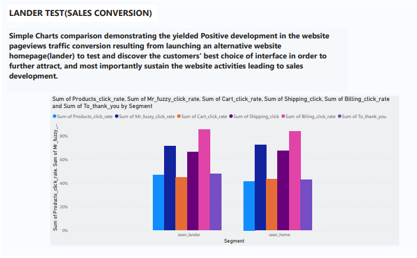
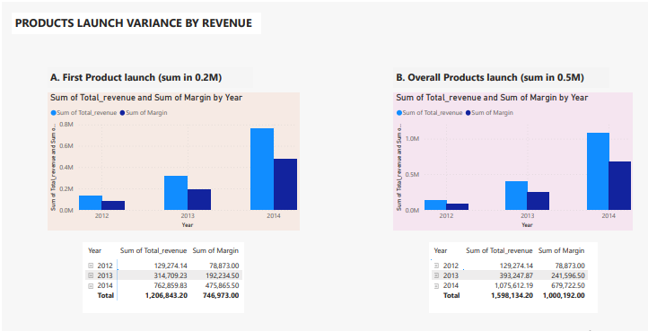

# Maven Fuzzy Factory — Website & Sales Performance Analysis

## Introduction

Maven Fuzzy Factory is a fictional e-commerce retail company used in the Maven Analytics **Advanced SQL: MySQL for Analytics & Business Intelligence** course.

In this project, I analyzed the company's website traffic, orders, products, and pageview data to understand how the business had developed since its launch.

The analysis focused on three main business tasks:

- Analyze and optimize marketing channels.
- Measure and test website conversion performance.
- Use the data to understand the impact of new product launches.

Using MySQL, I reviewed the company's growth, compared the performance of different traffic channels, performed a landing-page test and conversion funnel, and examined how the wider product offering contributed to sales.

### Headline Results

- Website sessions increased from **1,879 in Q1 2012 to 76,373 in Q4 2014**, while orders increased from **60 to 5,908**.
- The overall session-to-order conversion rate increased from about **3.19% to 7.74%** over the same period.
- **Gsearch nonbrand** remained the largest source of orders among the traffic channels reviewed.
- The `/lander-1` test page achieved a conversion rate of about **4.06%**, compared with **3.18%** for `/home`.
- Applying the observed landing-page conversion lift to later Gsearch nonbrand traffic gave an estimate of approximately **200 incremental orders**.
- Overall annual revenue reached about **$1.08 million in 2014**, alongside approximately **$680,000 in margin** as the company's product offering expanded.

The complete technical analysis is available in the SQL workflow, while the Power BI report provides a visual summary of selected findings.

### Project Materials

- **Dataset source:** [Maven Analytics — Advanced SQL: MySQL for Analytics & Business Intelligence](https://www.udemy.com/course/advanced-sql-mysql-for-analytics-business-intelligence) (course reference; the underlying dataset is not hosted in this repository).
- **[Complete SQL analysis](Analysis%20Workflow.sql):** Nine business questions, queries, and documented findings.
- **[Power BI template](Analysis%20Report.pbit):** A `.pbit` template, which may require Power BI Desktop to access it.

---

## Background

### About the Dataset

The Maven Fuzzy Factory dataset was designed and structured as part of the Maven Analytics **Advanced SQL: MySQL for Analytics & Business Intelligence** course to provide students with practical SQL and business analysis experience.

The dataset contains website session, pageview, order, product, and order-item activity that can be used to investigate the performance of a fictional e-commerce business.

### Data Context

The company, its activities, and the data used in this project are **fictional and intended for learning purposes**.

The analysis was structured around specific business activities and time periods according to the business questions being investigated. As a result, different parts of the analysis use different date ranges rather than one fixed period throughout the project.

### About the Company

Maven Fuzzy Factory is a fictional e-commerce retail company focused on stuffed-animal sales.

The company launched in **March 2012** and, within the setting of the project, had been operating for approximately three years. Its website activity provides records of customer sessions, pageviews, orders, and the revenue generated from those orders.

### Stakeholders

The business stakeholders represented in the project are:

1. **Cindy Sharp** — CEO
2. **Tom Parmesan** — Marketing Director
3. **Morgan Rockwell** — Website Manager

### Company Products

The product range covered in the project includes:

1. **The Original Mr. Fuzzy**
2. **The Forever Love Bear**
3. **The Birthday Sugar Panda**
4. **The Hudson River Mini Bear**

---

## Business Task & Objective

The main business tasks were to:

- Analyze and optimize marketing channels.
- Measure and test website conversion performance.
- Understand the impact of new product launches using the available data.

The broader objective was to extract and analyze website traffic and performance data to build a growth story around the company.

This involved looking beyond overall traffic and sales to understand which marketing channels were contributing to orders, how effectively the website converted its visitors, and how performance developed as the company introduced additional products.

The analysis was driven by the following questions:

- How did website traffic and orders develop over time?
- Did website conversion efficiency improve as the business grew?
- Which marketing channels generated the most orders, and how efficiently did they convert?
- Did the new landing page perform better than the original homepage?
- Where did customers progress or drop off within the website conversion funnel?
- How did business performance develop as new products were introduced?
- Did the wider product range create opportunities for cross-selling?

---

## Tools & SQL Techniques

| Tool | How It Contributed |
|---|---|
| **MySQL** | Queried website sessions, pageviews, orders, and order items; calculated business and conversion metrics; and built the landing-page and funnel analyses. |
| **Power BI** | Presented selected findings on company growth, marketing channels, landing-page performance, and product performance in a visual report. |

The SQL workflow made use of several functions and techniques introduced throughout the course, including:

- `SELECT`, `FROM`, `WHERE`, `GROUP BY`, `HAVING`, and `ORDER BY`
- `YEAR()`, `MONTH()`, and `QUARTER()`
- `COUNT()`, `COUNT(DISTINCT)`, `SUM()`, `MIN()`, and `MAX()`
- `CASE`
- `AND` and `IN`
- `LEFT JOIN` and `INNER JOIN`
- Temporary tables
- Conditional aggregation

Rather than using these techniques independently, they were combined throughout the workflow to answer the different business questions.

---

## Analytical Approach

I organized the nine SQL questions into four connected business investigations: **growth and website efficiency**, **marketing acquisition**, **landing-page conversion**, and **product expansion**. Each stage builds on the preceding one. Traffic growth provides context, conversion measures whether visits translate into orders, landing-page testing investigates an improvement opportunity, and product analysis examines how the business offering evolved.

This structure helps distinguish a descriptive result (such as rising sessions) from a decision-relevant comparison (such as conversion rates across landing pages). The SQL file retains the full query-level workflow.

---

## Analysis

### 1. Business Growth & Website Efficiency

The first part of the analysis was to understand how the company had grown since launch.

I reviewed website sessions and orders by quarter before comparing that growth with three efficiency measures:

- Session-to-order conversion rate
- Revenue per order
- Revenue per session

A representative query for the quarterly growth analysis was:

```sql
SELECT
    YEAR(website_sessions.created_at) AS year,
    QUARTER(website_sessions.created_at) AS quarter,
    COUNT(DISTINCT website_sessions.website_session_id) AS sessions,
    COUNT(DISTINCT orders.order_id) AS orders
FROM website_sessions
LEFT JOIN orders
    ON website_sessions.website_session_id = orders.website_session_id
WHERE website_sessions.created_at < '2015-01-01'
GROUP BY
    YEAR(website_sessions.created_at),
    QUARTER(website_sessions.created_at);
```

#### Result

| Metric | Q1 2012 | Q4 2014 |
|---|---:|---:|
| Website sessions | 1,879 | 76,373 |
| Orders | 60 | 5,908 |
| Session-to-order conversion | 3.19% | 7.74% |
| Revenue per order | $49.99 | $63.79 |
| Revenue per session | $1.60 | $4.93 |

The quarterly review shows an overall increase in both website sessions and orders.

The growth was not limited to website traffic. The website also became more effective at converting sessions into orders, while revenue per order and revenue per session increased over time.

Q4 recorded the highest activity in each complete year reviewed, although the analysis does not establish the specific reason for that pattern.

---

### 2. Marketing Channel Performance

The next stage was to understand where orders were coming from and how efficiently the different traffic channels converted.

The analysis compared:

- Gsearch nonbrand
- Bsearch nonbrand
- Gsearch/Bsearch brand
- Organic search
- Direct type-in

Conditional aggregation was used to compare the channels within the same quarterly analysis.

```sql
COUNT(DISTINCT CASE
    WHEN utm_source = 'gsearch'
        AND utm_campaign = 'nonbrand'
    THEN order_id
END) AS gsearch_nonbrand
```

#### Order Volume

Gsearch nonbrand generated the largest order volume among the reviewed channels throughout the analysis period.

Brand search, organic search, and direct type-in also developed over time, showing that order activity was not limited to nonbrand paid traffic alone.

However, order volume did not show how efficiently each source converted its traffic. So, I calculated the session-to-order conversion rate for the same channels.

> **Order volume** showed how much business each channel generated, while **conversion rate** showed how efficiently its sessions resulted in orders.

The quarterly review showed a general improvement in conversion performance across the reviewed channels over time.

---

### 3. Landing-Page Test & Conversion Funnel

One of the more detailed parts of the project was the comparison between the original `/home` page and the new `/lander-1` page.

The test focused on **Gsearch nonbrand sessions between June 19 and July 28, 2012**.

#### Identifying the Landing Page

I first identified the earliest pageview for each test session:

```sql
CREATE TEMPORARY TABLE landertest_firstpageview AS
SELECT
    website_pageviews.website_session_id,
    MIN(website_pageviews.website_pageview_id) AS min_pageview
FROM website_pageviews
INNER JOIN website_sessions
    ON website_sessions.website_session_id =
       website_pageviews.website_session_id
    AND website_sessions.created_at
        BETWEEN '2012-06-19' AND '2012-07-28'
    AND website_sessions.utm_source = 'gsearch'
    AND website_sessions.utm_campaign = 'nonbrand'
GROUP BY
    website_pageviews.website_session_id;
```

Then, the first pageview was used to determine whether each session landed on `/home` or `/lander-1`, before linking those sessions to orders.

#### Test Result

| Landing Page | Sessions | Orders | Conversion Rate |
|---|---:|---:|---:|
| `/home` | 2,261 | 72 | 3.18% |
| `/lander-1` | 2,316 | 94 | 4.06% |

`/lander-1` recorded the stronger session-to-order conversion rate during the test.

The difference represents an **absolute conversion-rate lift of approximately 0.88 percentage points**.

#### Estimating the Incremental Orders

The analysis then identified **22,972 subsequent Gsearch nonbrand sessions** after the original `/home` page stopped receiving this traffic.

Applying the approximate conversion lift from the workflow calculation:

```text
22,972 × 0.0087 ≈ 200
```

gave an **estimate of approximately 200 incremental orders** after the stronger landing page was introduced.

This figure is an estimate based on the observed conversion lift rather than a direct count of additional orders.

#### Conversion Funnel

The landing-page comparison was then extended into a full website conversion funnel.

For each session, I followed customer progress through:

```text
Landing Page
     ↓
Products
     ↓
Mr. Fuzzy
     ↓
Cart
     ↓
Shipping
     ↓
Billing
     ↓
Order Completion
```

Pageview activity was first flagged at the pageview level and then summarized at the session level before calculating the conversion rate between the different stages.

The funnel showed differences between the two landing pages at several stages of the customer journey.

`/lander-1` produced a higher click-through rate to the products page and a higher final billing-to-order completion rate than `/home`.

Not every individual funnel step was higher for `/lander-1`, so the result is better described as an **overall conversion improvement** rather than an improvement at every single stage.



---

### 4. Product Expansion & Cross-Selling

The company began with a single product and introduced additional products over time.

The final stage of the analysis examined how sales, revenue, margin, products-page activity, and cross-selling developed as the product offering expanded.

#### Revenue & Margin

I compared yearly performance from orders where Product 1 was the primary product with the overall results across all primary products.

```sql
SELECT
    YEAR(created_at) AS year,
    COUNT(DISTINCT order_id) AS total_sales,
    SUM(price_usd) AS total_revenue,
    SUM(price_usd - cogs_usd) AS margin
FROM orders
WHERE created_at < '2015-01-01'
GROUP BY
    YEAR(created_at);
```

| Year | Overall Revenue | Overall Margin |
|---|---:|---:|
| 2012 | $129,274.14 | $78,873.00 |
| 2013 | $393,247.87 | $241,596.50 |
| 2014 | $1,075,612.19 | $679,722.50 |

By 2014, overall revenue had reached approximately **$1.08 million**, with approximately **$680,000 in margin**.

The difference between the first-product results and overall results became more noticeable in 2013 and 2014 as additional products contributed to the company's performance.



#### Products-Page Performance

I also reviewed monthly activity on the `/products` page.

For each products-page session, the analysis identified whether the customer continued to another page and whether the session eventually resulted in an order.

The `/products` page attracted substantially more sessions over time. The percentage of sessions clicking through also generally improved, while the share of products-page sessions resulting in orders became stronger compared with the earlier periods.

#### Cross-Selling

Finally, I examined orders after Product 4 became a primary product in December 2014.

Calculating cross-sell performance by non-primary order items:

```sql
LEFT JOIN order_items
    ON orders.order_id = order_items.order_id
    AND order_items.is_primary_item = 0
```

Product 4 recorded the strongest cross-sell rate for orders where Products 1, 2, or 3 were the primary product:

| Primary Product | Product 4 Cross-Sell Rate |
|---|---:|
| Product 1 | 20.89% |
| Product 2 | 20.36% |
| Product 3 | 22.39% |

This shows an additional way the wider product range contributed to orders beyond primary-product sales.

---

## Business Implications & Next Questions

The results provide useful starting points for decisions, but each business action requires an appropriate comparison:

- **Marketing investment:** Gsearch nonbrand produced the most orders among the channels reviewed. Before reallocating advertising budgets, I would compare channel conversion rates with acquisition costs and customer value; order volume alone does not establish return on investment.
- **Website optimization:** `/lander-1` converted a larger share of the reviewed sessions than `/home`. The estimated incremental orders communicate potential business impact, but a stronger causal conclusion would require checking the experiment design, traffic allocation, and uncertainty around the observed difference.
- **Funnel improvement:** The funnel identifies stages where sessions stop progressing. I would prioritize the largest drop-offs for closer investigation rather than assume every stage improved under the new landing page.
- **Product and merchandising strategy:** Revenue and margin rose as the range expanded, and cross-sell relationships appeared in orders. The available analysis does not isolate the effect of each launch from other changes over time; product-level profitability and additional testing would strengthen future recommendations.

These are evidence-led directions for further analysis, not claims that the data proves a particular action will succeed.

---

## What I Learned

This project helped me move beyond using SQL only to retrieve records and toward using queries to answer connected business questions.

Some of the main lessons from the project were:

- Combining website session and order data to measure both **growth and conversion efficiency**
- Using conditional aggregation to compare several marketing channels within the same query
- Using temporary tables to break more detailed analyses into manageable stages
- Identifying a session's first pageview to compare landing-page performance
- Converting pageview-level activity into a session-level conversion funnel
- Distinguishing between **order volume and conversion efficiency** when reviewing traffic channels
- Comparing product-level and overall performance as the product range expanded
- Using order-item data to investigate cross-selling between products

The project also changed how I think about analytical evidence. **A bigger number is not always a better outcome:** more sessions do not necessarily imply stronger conversion, and more channel orders do not establish better marketing efficiency. Comparing conversion rates helped me ask a more precise business question.

The landing-page test taught me to separate an **observed difference** from an **estimated business impact**. The approximately 200 incremental orders were calculated by applying a conversion lift to later traffic; they were not directly counted as additional orders. Similarly, the product analysis showed me that growth occurring alongside new product launches does not by itself prove the launches caused all the growth.

Finally, building the funnel with temporary tables helped me see how SQL can model a customer journey, not just summarize a dataset. My main takeaway is to begin with a decision-oriented question, choose the correct metric and comparison, and explain both what the results suggest and what remains unproven.

---

## Scope & Limitations

- The company and dataset are fictional course materials; the results should be understood as an educational business case.
- Different investigations use different date windows: the quarterly growth review ends before 2015, the landing-page comparison covers June–July 2012, and the product-related work extends into March 2015. They should not be presented as one uniform reporting period.
- Marketing-channel order volume and conversion do not include advertising spend or customer acquisition costs, so channel profitability cannot be established.
- The analysis observes changes alongside product expansion but does not highlight the causal effect of new product introductions.
- The repository provides SQL and a Power BI template. Reproducing the queries or opening a fully populated Power BI report may require the original course database and local software.

---

## Conclusion

The analysis shows that Maven Fuzzy Factory recorded substantial growth in both website activity and orders over the period reviewed.

Website efficiency improved alongside that growth, with stronger conversion rates and revenue per session. Gsearch nonbrand remained the largest source of orders among the channels reviewed, while brand, organic, and direct traffic also developed over time.

The `/lander-1` test produced a stronger overall conversion result than `/home`. Applying the observed conversion lift to later Gsearch nonbrand traffic gave an estimate of approximately **200 incremental orders**.

The business also recorded stronger overall sales, revenue, and margin as its product offering expanded, while the cross-sell analysis showed additional purchasing relationships between the products.

Overall, the project provided a broader view of how **traffic acquisition, website conversion, and product expansion** contributed to the company's performance.

---
